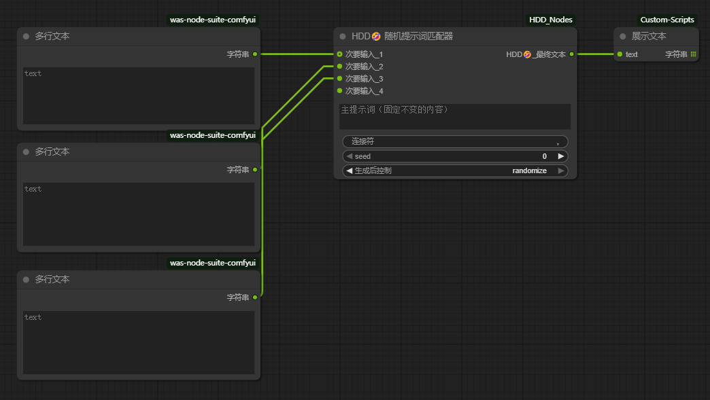

# ComfyUI HDD Nodes 🤣

这是一个由 **ComfyUI 节点开发大师** 协助开发的自定义节点包。
This is a custom node package for ComfyUI.

## 功能 (Features)

### HDD🤣 随机提示词匹配器
这是一个强大的提示词组合工具，支持动态无限输入。
- **主输入**：固定不变的提示词。
- **次要输入**：支持无限连接。会自动从每个连接的输入框中随机抽取一行文本进行组合。
- **动态接口**：连接一个输入口，自动出现下一个；断开自动回收。
- **随机控制**：支持固定种子、增加、减少或完全随机。

### 节点由AI编写

## 安装方法 (Installation)

1. 进入 ComfyUI 的 `custom_nodes` 目录。
2. 打开终端 (CMD) 运行：
   ```bash
   git clone [https://github.com/你的用户名/ComfyUI-HDD-Nodes.git](https://github.com/你的用户名/ComfyUI-HDD-Nodes.git)
